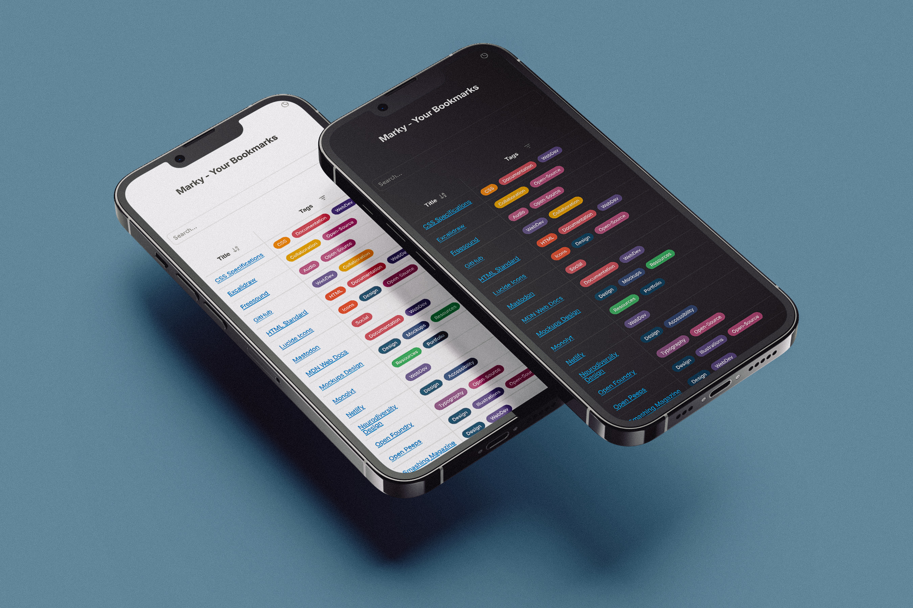

# Marky - Your Bookmarks

**Marky** is a self-hosted, progressive web application designed to organize and serve your bookmarks efficiently. It offers a clean and intuitive interface, allowing users to save, search, and retrieve bookmarks in a structured way. With PWA support, you can even access your bookmarks offline.

## Features

- **Searchable and Sortable Table**: Easily search and sort bookmarks by title, description, or tags.
- **Dark Mode**: Switch between light and dark mode for comfortable viewing.
- **Tag Filtering**: Filter bookmarks based on tags for easier categorization.
- **Progressive Web App (PWA)**: Install Marky on your device for offline access.
- **Responsive Design**: Optimized for both desktop and mobile use.

## Screenshots



## Getting Started

### 1. Clone the repository to your local machine:
```bash
git clone https://github.com/monolyt/marky.git
```
### 2. Navigate into the `marky`directory:
```bash
cd marky
```
### 3. Fill out the `bookmarks.json` file:
The bookmarks.json file holds all of your bookmarks. Before hosting, you’ll need to customize this file with your own bookmarks. Each entry in bookmarks.json should have the following structure:
```json
[
{
    "title": "Example Bookmark",
    "description": "A description of the link",
    "url": "https://example.com",
    "tags": ["example", "bookmark"]
},
{
    "title": "Another Bookmark",
    "description": "A different description",
    "url": "https://anotherexample.com",
    "tags": ["another", "example"]
}
]
```
- title: The name of the bookmark as it will appear in the list.
- description: A brief description of what the link is about.
- url: The link itself.
- tags: A list of tags to categorize and search for the bookmark (e.g., "news", "tech").
Add as many bookmark entries as needed following this structure; they don't need to be in alphabetical order - the script sorts them by default.
### 4. Host the folder on a static web server (e.g. Netlify)
Once deployed, Netlify will provide a unique URL for your site. This URL is random and therefor (relatively) private. It's publicly accessible, which enables you to access it on mobile as well.

